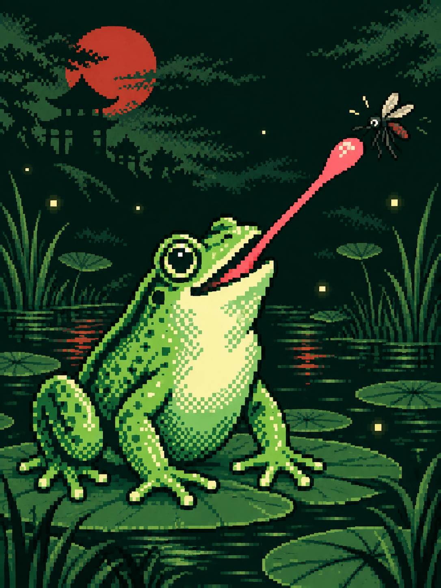
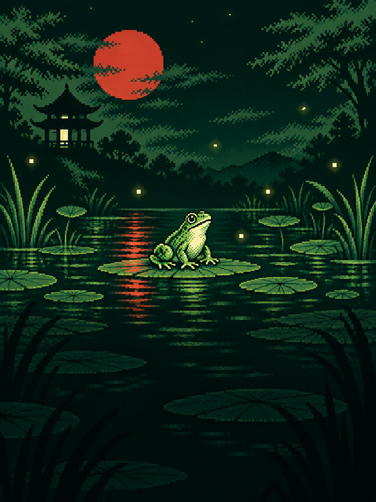
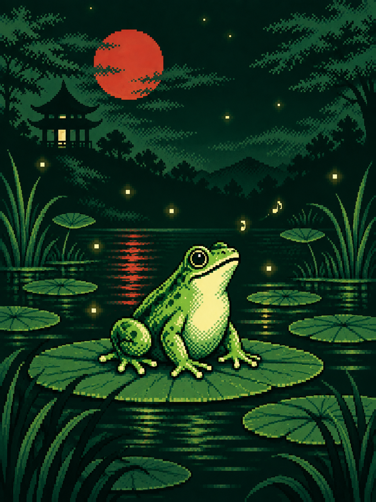
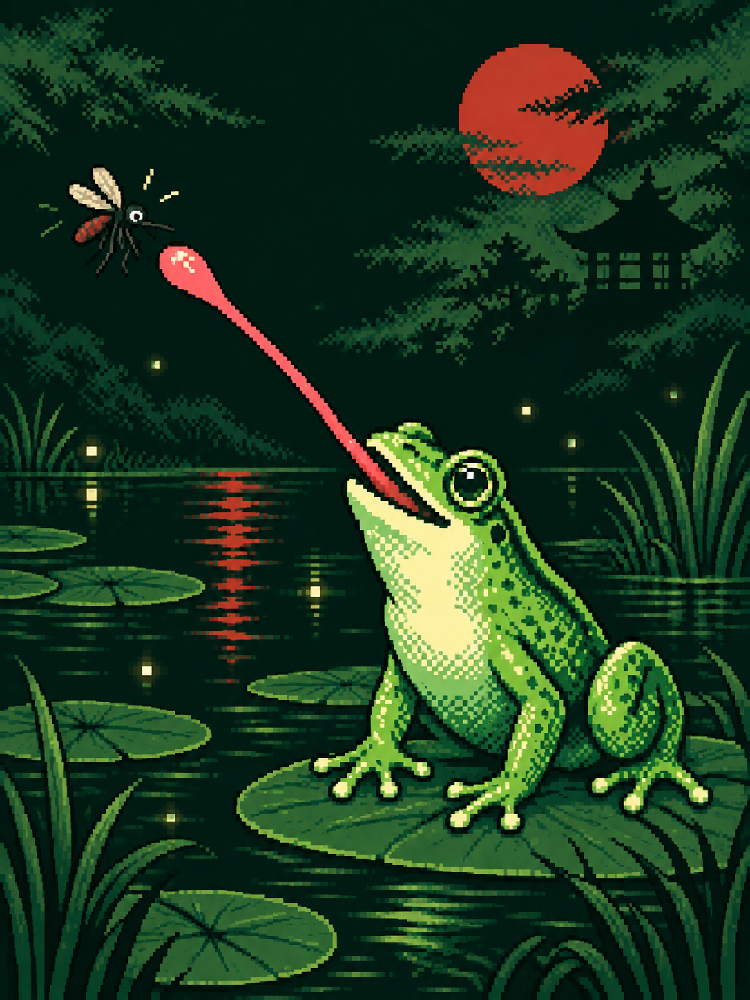
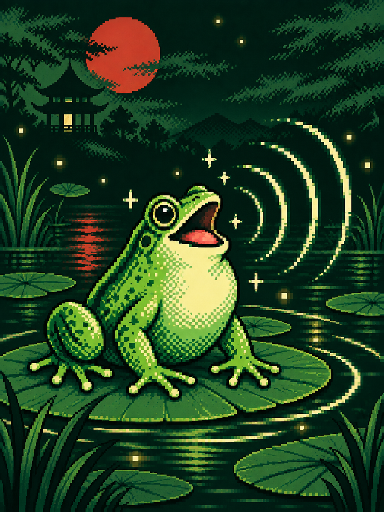

<p align="right">
  <a href="README.zh_CN.md">简体中文</a> · <strong>English</strong>
</p>

# Buzz Off

<p align="center">
  
</p>

**A pixel-style ultrasonic mosquito-repeller gadget with a frog that turns every catch into a tiny arcade moment.**

Buzz Off transforms FoloToy AI Passport into a playful night-pond companion. Press **OK** to start the high-frequency sound, then watch the bright green frog track mosquitoes, snap out its tongue, and grow the catch counter. Every second catch is celebrated with a real bullfrog call.

## How to play

1. Power on and enjoy the Game Boy-inspired reveal with the CLOUDFINGER signature.
2. During standby, the pond stays calm and the background melody plays.
3. Press **OK** to start the mosquito-repeller sound and catch animation.
4. Press **UP** or **DOWN** to switch between the 12, 16, and 20 kHz sound modes.
5. Press **OK** again to stop and return to the standby melody.

The mosquito, tongue, catch animation, and counter movement appear only while Buzz Off is running. When it stops, the frog returns to a clean, peaceful pond.

## App gallery

The images below are representative gameplay illustrations based on the app's pixel art. They are not device screenshots.

<table>
  <tr>
    <td width="50%" align="center">
      <br>
      <strong>Boot reveal</strong>
    </td>
    <td width="50%" align="center">
      <br>
      <strong>Peaceful standby</strong>
    </td>
  </tr>
  <tr>
    <td width="50%" align="center">
      <br>
      <strong>Mosquito catch</strong>
    </td>
    <td width="50%" align="center">
      <br>
      <strong>Bullfrog call</strong>
    </td>
  </tr>
</table>

## What makes it fun

- A polished Japanese pixel-handheld visual style.
- A frog that watches, strikes, chews, and celebrates each catch.
- Three sound modes to explore with the physical buttons.
- An original standby melody and an authentic bullfrog recording.
- A running catch counter that gives the little tool an arcade personality.

## Firmware

The verified complete firmware is named:

```text
folotoy-ai-passport-buzzoff.bin
```

Build and validation instructions are in [Build and Test](docs/development/engineering/build-and-test.md). Flashing guidance and the protected-device-data precautions are documented there as well.

## Credits

Buzz Off is created by **CLOUDFINGER**. The frog, wetland scene, and community gallery are project-original AI-generated artwork. The bullfrog call uses a public-domain recording from the [U.S. Geological Survey](https://www.usgs.gov/media/videos/american-bullfrogs-lithobates-catebeianus).

## License

Source code is provided under the repository's [Apache License 2.0](LICENSE).
